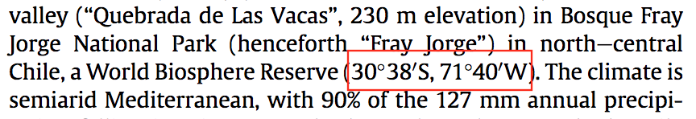

### R packages

```{r echo=TRUE}
library(rdataretriever)
library(dplyr)
library(ggplot2)
library(tidyr)
library(testthat)
library(ncdf4)
library(rgdal)
```

### Temperature data

#### TODO

* Create test for reasonable temp range for Florida location

Requirements: 

* Global in extent
* Year range of 1950-now
* Fairly fine spatial resolution

**Berkeley Earth** dataset includes all of these: 

* [Website](http://berkeleyearth.org/data/)
* Monthly Land, 1* x 1* Latitude-Longitude Grid
* Total global range is ~1890 to 2013
* 1 degree x 1 degree latitude/longitude grid

For what this grid size means, see the red grid around Portal


```{r}
if(!file.exists("../data/temperature/Complete_TAVG_LatLong1.nc")){
  download.file("http://berkeleyearth.lbl.gov/auto/Global/Gridded/Complete_TAVG_LatLong1.nc", "../data/temperature/Complete_TAVG_LatLong1.nc")
}
```
Download Berkeley Earth temperature data using dataretriever if it isn't already. 
```{r}
temp = nc_open("../data/temperature/Complete_TAVG_LatLong1.nc")
```
Read in temperature data. 

#### Metadata notes

* Documentation [here](http://berkeleyearth.lbl.gov/auto/Global/Gridded/Gridded_README.txt)
* Latitude and longitude "values are in degrees, with positive values used for 
Northern/Eastern Hemisphere"
    * United States is something like -100, 40
* Lat and lon are center of grid box; need to find closest one for each site (rounding?)
    * Possibly generate map with each location and respective grid? 
* Time is a single value, with year, decimal point, then fraction of year for
month midpoint
    * E.g., "1981.125 indicates February 1981", or .125 x 12 == 1.5
    * Create table of these values with corresponding months and years
* Temperature is temp anomaly value (?), maybe multiplied by lat and lon?
* What's the baseline/reference for the anomaly? 
* Missing temp value is NaN; does R read this in correctly? 
* land_mask is amount of cell that is land
* Climatology variable includes actual temperature, but is average across each
month from 1951-1980? 
* No uncertainty
* "Compression level 9"?
```{r}
attributes(temp)$names
```
Temperature file contents (all described in metadata): 

* `r temp$nvars` variables = `r attributes(temp$var)$names`
    * Will use `r attributes(temp$var)$names[2]`?
* `r temp$ndims` dimensions = `r attributes(temp$dim)$names`
* `r temp$natts` NetCDF attributes = general info about dataset
* Temperature dataset attributes are `r ncatt_get(temp, attributes(temp$var)$names[2])`
* Temperature dataset dimensions in order are
    1. `r attributes(temp$dim)$names[1]` (limit: `r dim(temp_variable_all)[1]`)
    2. `r attributes(temp$dim)$names[2]` (limit: `r dim(temp_variable_all)[2]`)
    3. `r attributes(temp$dim)$names[3]` (limit: `r dim(temp_variable_all)[3]`)

```{r}
temp_variable_all = ncvar_get(temp, attributes(temp$var)$names[2])
```
Generate temperature variable dataset. 

```{r}
ncatt_get(temp, attributes(temp$dim)$names[3])
```


```{r}
temp_variable_all[105, 40, 100]
```
What are the value ranges of the three dimensions? 
```{r}
#nc_close(temp)
```
Closing temperature data throws error, but is a recommended step. 

### Dataset 1: Portal

#### TODO

* Retain only adults; age column == Z? 
* Retain each individual only once? 
* Choose which experimental treatments to use

```{r}
if(!file.exists("../data/raw_portal/portal_dev_rodent_trapping.csv")){
  rdataretriever::install(dataset = "portal-dev", connection = "csv", data_dir = "../data/raw_portal/")
}
```
Download all Portal data using dataretriever if it isn't already. 
```{r}
portal_occurrences = read.csv("../data/raw_portal/portal_dev_rodent.csv")
dim(portal_occurrences)
head(portal_occurrences)
```
Read in Portal mammal occurrence data. 

```{r}
#colnames(portal_occurrences)
unique(portal_occurrences$age)
head(unique(portal_occurrences$tag), n = 20)
head(unique(portal_occurrences$ltag), n = 20)
```
Start looking at age class and tags for each occurrence. 
```{r}
portal_species = read.csv("../data/raw_portal/portal_dev_rodent_species.csv")
portal_species
```
Read in species data to remove non-rodent species from occurrence data. 
```{r}
table(portal_species$rodent)
rodent_list = portal_species %>% 
  filter(rodent == 1)
rodent_list
```
Generate list of rodent species. 
```{r}
by_sp_yr = portal_occurrences %>% 
  filter(!is.na(wgt), !is.na(species), species %in% rodent_list$species_code) %>% 
  group_by(species, yr) %>% 
  summarize(mass_mean = mean(wgt), 
            mass_sd = sd(wgt))
by_sp_yr
```
Create new dataframe containing mean and standard deviation of each species' mass for each year, 
removing rows with no weight or no species ID and retaining only rodents. 

The minimum mean mass is `r min(by_sp_yr$mass_mean)` and max is `r max(by_sp_yr$mass_mean)`. 
There are `r length(unique(by_sp_yr$species))` species across `r length(unique(by_sp_yr$yr))` years. 
```{r}
ggplot(data = by_sp_yr, aes(x = yr, y = mass_mean)) +
  geom_errorbar(aes(ymin = mass_mean - mass_sd, ymax = mass_mean + mass_sd)) +
  geom_point() +
  facet_wrap(~species, scale = "free_y")
```
Plot mass mean and sd by species across years.

### Dataset 2: Fray Jorge

##### Notes

* [Mammal metadata](http://www.esapubs.org/archive/ecol/E094/084/Fray_Jorge_Small_Mammal_Metadata.php) 
from ESA Ecological Archives

#### TODO

* Choose which experimental treatments to use
* Get corresponding species names for species code column (sp) from Table 2 in
[metadata](http://www.esapubs.org/archive/ecol/E094/084/Fray_Jorge_Small_Mammal_Metadata.php)
* Double check that mass column (wt) is in grams
* Data only goes to 2005, but the project has been funded since then; are there more years? 
* Determine if precip data also contains temperature
* Choose which experimental treatments to use (trt col)
* Retain only adults (sst column?) 
* Retain each individual only once (AnimalID col)? 

```{r}
if(!file.exists("../data/raw_frayjorge/fray_jorge_ecology_mammals.csv")){
  rdataretriever::install(dataset = "fray-jorge-ecology", connection = "csv", data_dir = "../data/raw_frayjorge/")
}
```
Download all Fray Jorge data using dataretriever if it isn't already. 

Note: they use periods for missing data
```{r}
fray_occurrences = read.csv("../data/raw_frayjorge/fray_jorge_ecology_mammals.csv", na.strings = ".")
dim(fray_occurrences)
head(fray_occurrences)
```
Read in Fray Jorge mammal occurrence data. 
```{r}
fray_occurrences = fray_occurrences %>% 
  separate(mo, into = c("year", "month"), sep = 4, remove = FALSE, convert = TRUE)
```
Separate mo column into year and month columns. 
```{r}
by_sp_yr_fray = fray_occurrences %>% 
  filter(!is.na(wt), !is.na(sp)) %>% 
  group_by(sp, year) %>% 
  summarize(mass_mean = mean(wt), 
            mass_sd = sd(wt))
by_sp_yr_fray
```
Create new dataframe containing mean and standard deviation of each species' mass for each year, 
removing rows with no weight or no species ID. 

The minimum mean mass is `r min(by_sp_yr_fray$mass_mean)` and max is `r max(by_sp_yr_fray$mass_mean)`. 
There are `r length(unique(by_sp_yr_fray$sp))` species across `r length(unique(by_sp_yr_fray$year))` years. 
```{r}
ggplot(data = by_sp_yr_fray, aes(x = year, y = mass_mean)) +
  geom_point() +
  geom_errorbar(aes(ymin = mass_mean - mass_sd, ymax = mass_mean + mass_sd)) +
  facet_wrap(~sp, scales = "free_y")
```
Plot mass mean and sd by species across years.
```{r}
ggplot(fray_occurrences, aes(x = year)) +
  geom_bar() +
  facet_wrap(~sp, scales = "free_y")
```
Plot number of individuals of each species across years. 

### Dataset 3: Thibault et al., 2011

Ecological Archives documentation of data [here](http://esapubs.org/archive/ecol/E092/201/). 

#### TODO

* Determine if there is even enough data (number of individuals, year range) here to use


```{r}
if(!file.exists("../data/raw_thibault/mammal_community_db_communities.csv")){
  rdataretriever::install(dataset = "mammal-community-db", connection = "csv", data_dir = "../data/raw_thibault/")
}
```
Download all data from Thibault data paper using dataretriever if it isn't already. 

```{r}
thibault_df = read.csv("../data/raw_thibault/mammal_community_db_communities.csv")
head(thibault_df)
```

```{r}
dim(thibault_df)
length(which(!is.na(thibault_df$mass)))
```

```{r}
thibault_df_mass = thibault_df %>% 
  filter(!is.na(mass))
thibault_df_mass
```
Of `r length(unique(thibault_df$site_id))` sites in the entire dataset,
`r length(unique(thibault_df_mass$site_id))` have some mass measures. For sites
with masses, do all occurrences have mass values? 

### Site locations

#### TODO

* Get latitude and longitude for each dataset's site
* Document source for each of these
* Convert normal lat/lon to temp grid lat/lon? 

```{r}
site_locations = data.frame()
```
Create empty dataframe that will store location values. 

#### Portal

Notes

* From [Ernest et al., 2016](https://esajournals.onlinelibrary.wiley.com/doi/abs/10.1890/15-2115.1)
* Couldn't find location information in retriever versions of Portal data
* Expect Portal to be about -109.063, 31.9107
* In UTM zone 12

#### TODO 

* Add test for UTM to lat/lon conversion?

```{r}
if(!file.exists("../data/raw_portal/Portal_UTMCoords.csv")){
  download.file("https://esajournals.onlinelibrary.wiley.com/action/downloadSupplement?doi=10.1890%2F15-2115.1&file=ecy1360-sup-0001-DataS1.zip", 
               "../data/raw_portal/ecy1360-sup-0001-datas1.zip")
  unzip("../data/raw_portal/ecy1360-sup-0001-datas1.zip", exdir = "../data/raw_portal/")
}
```
Download data containing Portal coordinates. 
```{r}
portal_coords = read.csv("../data/raw_portal/Portal_UTMCoords.csv")
```
Read in particular dataset with coordinates. 
```{r}
portal_mean_UTM = SpatialPoints(cbind(mean(portal_coords$east), mean(portal_coords$north)), proj4string = CRS("+proj=utm +zone=12 +datum=WGS84"))
portal_mean_latlon = as.data.frame(spTransform(portal_mean_UTM, CRS("+proj=longlat +datum=WGS84")))
```
Generate variables for each coordinate direction, then convert from UTM to lat/lon. 
```{r}
site_locations = site_locations %>% 
  bind_rows(c(site_name = "Portal", 
              lon = portal_mean_latlon$coords.x1, 
              lat = portal_mean_latlon$coords.x2))
site_locations
```
Add Portal lat/lon to locations dataframe. 

#### Fray Jorge

Notes

* From "Materials and Methods" section in Aguilera et al. (2015)

* Expect latitude to be -30ish and longitude to be -71ish

#### TODO

* Find second source for Fray Jorge coordinates

```{r}
deg_min_sec_to_dec = function(degree, minute, second, direction = NULL){
  decimal_degree = degree + (minute * (1/60)) + (second * (1/60) * (1/60))
  if(direction == "S" | direction == "W"){
    decimal_degree = -decimal_degree
  }
  return(decimal_degree)
}
```
Function to convert degree minute second coordinates to decimal degrees. 
```{r}
fray_jorge_lat = deg_min_sec_to_dec(30, 38, 0, "S")
fray_jorge_lon = deg_min_sec_to_dec(71, 40, 0, "W")
```
Use function to convert Fray Jorge coordinates. 
```{r}
site_locations = site_locations %>% 
  bind_rows(c(site_name = "Fray Jorge", 
              lon = fray_jorge_lon, 
              lat = fray_jorge_lat))
site_locations
```
Add converted Fray Jorge coordinates to locations dataframe. 
